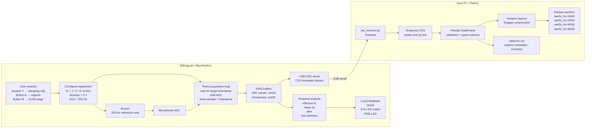

<p align="center">
  
</p>

# RITA

**RITA — Restrição e Implicação da Taxa de Amostragem.**

Experimento em sistemas embarcados para investigar o impacto de diferentes taxas de amostragem afetam a representação do sinal, volume e fluxo de dados.

## Overview

RITA é uma projeto de sistemas embarcados desenvolvido usando a plataforma  BitDogLab.

O sistema adquire dados em diferentes taxas de amostragem e performa tanto a aquisição quanto armazena em buffer e transmite as amostras coletadas a um outro dispositivo, no contexto do experimento o computador energizando a placa, permitindo armazenamento e analise dos dados

As principais questoes que motivam o projeto são:

> Como a taxa de amostragem afeta a quantidade de informação disponível


### Embedded system

The firmware is implemented in MicroPython and is responsible for:

- Aquisição dos dados via sensor;
- temporização da amostragem;
- comfiguração do tempo desejado;
- buffering dos dados;
- visualização do OLED ;
- interface do usuário;
- transmissao via USB;
- Analise inicial on board.

Code: [`firmware/`](firmware/)

### Host-side processing

Scripts rodando na máquina host permitem:

- Aquisição e armazenamento;
- geração de dataset;
- Conversão dos dados em CSV/Parquet;
- Visualização do sinal;
- Analise aprimorada.
## Diagram

```
